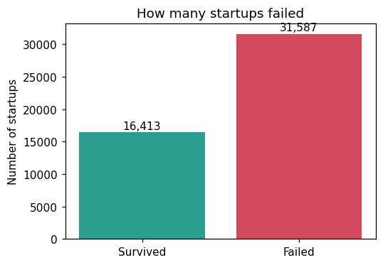
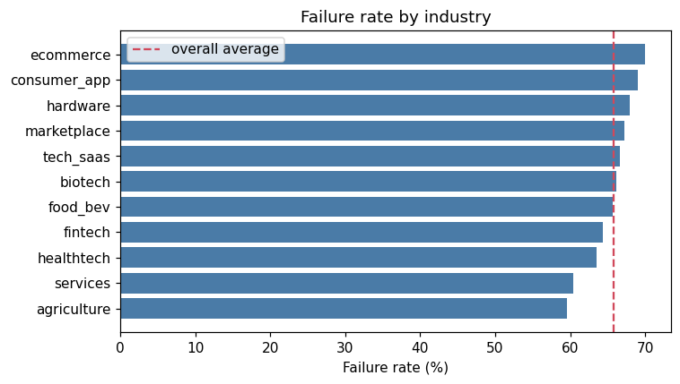
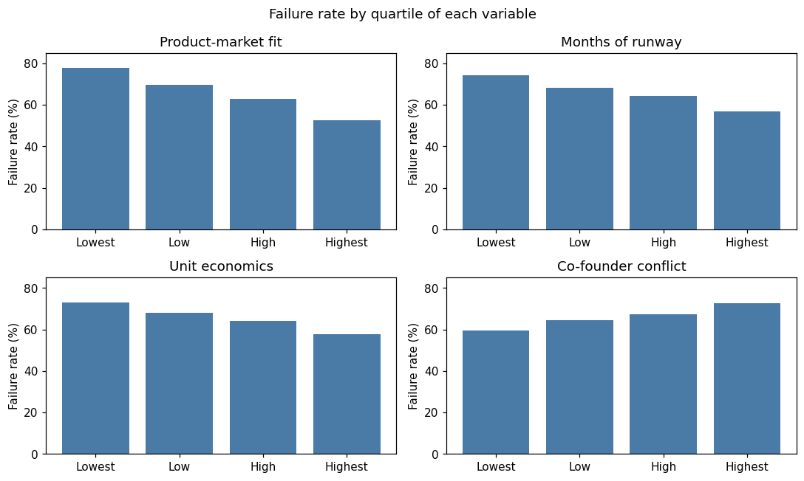
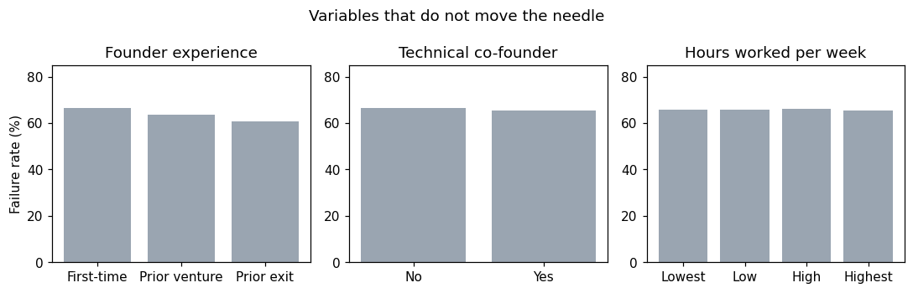
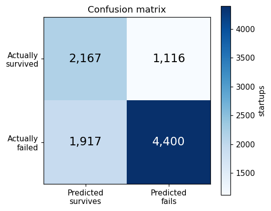
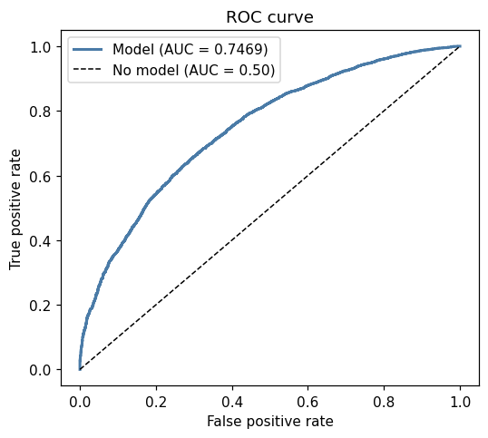
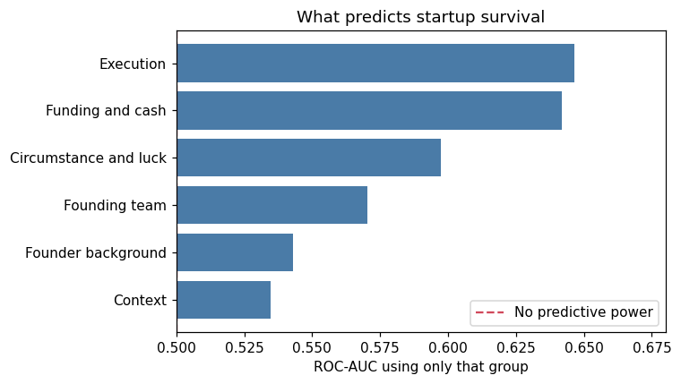

<p align="center"></p>

<h3 align="center">Universidad Nacional del Altiplano</h3>
<p align="center">Facultad de Ingeniería Mecánica Eléctrica, Electrónica y Sistemas<br>
Unidad de Posgrado de Ingeniería de Sistemas<br>
Maestría en Ciencia de Datos</p>

# Predicción de la Supervivencia de Emprendimientos

Desarrollo y despliegue de una aplicación de aprendizaje automático en producción

| | |
|---|---|
| Curso | Machine Learning |
| Docente | Ing. Mayenka Fernandez |
| Estudiante | Taco Avilés, Milton Hiroshi |
| Lugar y fecha | Puno, setiembre de 2026 |
| Aplicación | [startupml.kamai.life](https://startupml.kamai.life) |
| Versión en PDF | [docs/Informe_Unidad_I.pdf](docs/Informe_Unidad_I.pdf) |

## Contenido

- [1. Introducción](#1-introducción)
- [2. Método](#2-método)
   - [2.1. Conjunto de Datos](#21-conjunto-de-datos)
   - [2.2. Descripción de las Variables](#22-descripción-de-las-variables)
   - [2.3. Selección de Variables](#23-selección-de-variables)
   - [2.4. Preprocesamiento](#24-preprocesamiento)
   - [2.5. Partición de los Datos](#25-partición-de-los-datos)
   - [2.6. Comparación de Algoritmos y Búsqueda de Hiperparámetros](#26-comparación-de-algoritmos-y-búsqueda-de-hiperparámetros)
   - [2.7. Selección del Umbral de Decisión](#27-selección-del-umbral-de-decisión)
   - [2.8. Estudio de Aporte por Grupo de Variables](#28-estudio-de-aporte-por-grupo-de-variables)
- [3. Resultados](#3-resultados)
   - [3.1. Comportamiento de las Variables](#31-comportamiento-de-las-variables)
   - [3.2. Desempeño Comparado de los Algoritmos](#32-desempeño-comparado-de-los-algoritmos)
   - [3.3. Matriz de Confusión](#33-matriz-de-confusión)
   - [3.4. Qué Características Anticipan la Supervivencia](#34-qué-características-anticipan-la-supervivencia)
- [4. Construcción de la Aplicación](#4-construcción-de-la-aplicación)
   - [4.1. Arquitectura](#41-arquitectura)
   - [4.2. Dos Interfaces para Dos Usuarios](#42-dos-interfaces-para-dos-usuarios)
   - [4.3. Interfaz de Programación](#43-interfaz-de-programación)
- [5. Despliegue en Producción](#5-despliegue-en-producción)
- [6. Pruebas de Funcionamiento](#6-pruebas-de-funcionamiento)
- [7. Limitaciones](#7-limitaciones)
- [8. Conclusiones](#8-conclusiones)
- [9. Enlaces y Acceso al Proyecto](#9-enlaces-y-acceso-al-proyecto)
- [10. Referencias](#10-referencias)

---

## 1. Introducción

La mayoría de los emprendimientos no sobrevive. Determinar por qué unos prosperan y otros no es una pregunta clásica de la literatura de gestión, y su interés no es solo académico: incubadoras, aceleradoras e inversionistas deciden a diario a qué proyectos asignar recursos escasos.

El presente informe documenta el desarrollo de una aplicación que estima la probabilidad de que un emprendimiento sobreviva, empleando únicamente información disponible al momento de su fundación. La pregunta que guía el trabajo es qué características permiten anticipar esa supervivencia, y para responderla el procedimiento de entrenamiento no se limita a ajustar un modelo, sino que mide de forma explícita cuánto aporta cada grupo de variables.

El objetivo del proyecto excede el modelado. Siguiendo el planteamiento de Sculley et al. (2015), quienes advierten que el código de aprendizaje automático constituye una fracción mínima de un sistema real en producción, la aplicación se construyó como un producto de software completo: dos interfaces orientadas a usuarios distintos, una interfaz de programación documentada, veintinueve pruebas automatizadas y una estrategia de despliegue contenerizada.

## 2. Método

### 2.1. Conjunto de Datos

Se empleó el conjunto startup_survival_master, que contiene 48 000 emprendimientos descritos por 30 variables. El diccionario de datos agrupa las variables según su naturaleza en cuatro categorías (circunstancia o azar, perfil del fundador, equipo fundador y ejecución), a las que el presente trabajo añade dos agrupaciones propias: financiamiento y contexto sectorial. Esa agrupación resultó ser el eje del análisis.

El conjunto corresponde a una simulación calibrada sobre la literatura de fracaso de emprendimientos, no a empresas reales, y así se declara. Esta condición exigía una verificación previa, pues un conjunto sintético mal construido puede contener una regla determinista oculta que vuelve trivial el problema. Se aplicó una prueba de separabilidad lineal: un modelo lineal ajustado sobre la totalidad de las 48 000 observaciones comete 13 842 errores y las distribuciones de ambas clases se solapan. No existe, por tanto, una fórmula subyacente recuperable, y el problema de modelado es genuino.

La consecuencia de esta condición es interpretativa y se explicita aquí: los hallazgos describen la estructura del conjunto de datos y su coincidencia con lo reportado por la literatura, y no constituyen evidencia empírica nueva sobre emprendimientos reales.

### 2.2. Descripción de las Variables

La Tabla 1 presenta las diecisiete variables retenidas, organizadas según el grupo al que pertenecen.

Tabla 1

*Variables Empleadas por el Modelo, según Grupo*

| Grupo | Variables |
|----|:--:|
| Circunstancia y azar | macro_climate, market_size_score, competition_intensity |
| Perfil del fundador | founder_prior_exits, domain_experience_years |
| Equipo fundador | cofounder_conflict, team_completeness |
| Ejecución | product_market_fit_score, did_customer_validation, premature_scaling, unit_economics_score, marketing_effectiveness |
| Financiamiento y caja | funding_path, total_raised_usd, monthly_burn_rate, runway_months |
| Contexto sectorial | industry |

*Nota.* Diecisiete variables en total. La agrupación proviene del diccionario del conjunto de datos, ampliada con las categorías de financiamiento y contexto definidas en este trabajo.

La Tabla 2 resume los estadísticos descriptivos de las variables numéricas de mayor relevancia. Se observa que las magnitudes monetarias presentan distribuciones marcadamente asimétricas: la mediana del capital levantado asciende a 111 000 dólares mientras que la media alcanza 1 607 581, diferencia atribuible a un reducido número de emprendimientos con financiamiento muy superior al resto.

Tabla 2

*Estadísticos Descriptivos de las Variables Numéricas Principales*

| Variable                 |     M     |    DE     |   Mdn   | Mín. |    Máx.    |
|--------------------------|:---------:|:---------:|:-------:|:----:|:----------:|
| product_market_fit_score |   4.61    |   2.24    |  4.60   | 0.0  |    10.0    |
| runway_months            |   18.88   |   8.14    |  18.80  | 2.0  |    50.0    |
| cofounder_conflict       |   4.08    |   2.22    |  4.00   | 0.0  |    10.0    |
| team_completeness        |   5.33    |   2.16    |  5.30   | 0.0  |    10.0    |
| macro_climate            |   5.01    |   1.98    |  5.00   | 0.0  |    10.0    |
| domain_experience_years  |   5.43    |   4.03    |  4.40   | 0.0  |    30.0    |
| monthly_burn_rate (USD)  |  99 068   |  280 513  |  6 300  | 500  | 3 000 000  |
| total_raised_usd (USD)   | 1 607 581 | 3 972 697 | 111 000 |  0   | 52 171 000 |

*Nota.* N = 48 000. Los puntajes se expresan en escala de 0 a 10.

La variable objetivo se encuentra desbalanceada, según se aprecia en la Figura 1.

Figura 1

*Distribución de la Variable Objetivo*

<p align="center"></p>

*Nota.* N = 48 000. El desbalance hacia el fracaso condiciona la elección de métricas de evaluación.

### 2.3. Selección de Variables

De las 30 columnas disponibles se emplearon 17. Las 13 restantes se descartaron por dos motivos de naturaleza distinta.

Seis columnas se excluyeron por fuga de información. Las variables outcome, failure_reason, years_to_outcome y survived_5y solo se conocen una vez que el emprendimiento ya fracasó o sobrevivió. Incluirlas habría elevado artificialmente las métricas y producido un modelo inútil en producción, donde esos datos todavía no existen. La exclusión no se dejó librada a la disciplina del programador: una prueba automatizada verifica que ninguna de esas columnas figure entre las variables del modelo.

Las siete columnas restantes se descartaron por ausencia de aporte. Una medición de importancia por permutación mostró que pivots, technical_cofounder, prior_failures, weekly_hours, founding_year, n_cofounders y age_of_founder no producían una caída medible del área bajo la curva al ser permutadas. Su eliminación se verificó empíricamente: el área bajo la curva pasó de 0.7420 con las 24 variables a 0.7422 con las 17 retenidas. Dado que no había pérdida, se prefirió el modelo más parsimonioso, decisión que además reduce la cantidad de datos que la aplicación debe solicitar al usuario.

### 2.4. Preprocesamiento

Las dos variables categóricas, industry y funding_path, se transformaron mediante codificación uno-en-N. El parámetro handle_unknown se configuró en ignore, decisión que responde a una exigencia operativa: en producción aparecerán sectores que no existían al momento del entrenamiento, y el servicio debe continuar respondiendo en lugar de interrumpirse. Una prueba automatizada envía deliberadamente un sector inexistente y verifica que la respuesta siga siendo válida.

Las quince variables numéricas se estandarizaron. El procedimiento es necesario porque sus escalas difieren en varios órdenes de magnitud: total_raised_usd alcanza los 52 millones de dólares mientras que product_market_fit_score se mide de cero a diez. Sin estandarizar, la regresión logística asignaría una importancia desproporcionada a la primera por el solo hecho de tomar valores mayores.

### 2.5. Partición de los Datos

El conjunto se dividió en tres particiones estratificadas: 28 800 observaciones para entrenamiento, 9 600 para validación y 9 600 para prueba. La partición en tres, y no en dos, obedece a que el procedimiento toma dos decisiones distintas que no pueden compartir los mismos datos: la búsqueda de hiperparámetros se realiza mediante validación cruzada sobre el conjunto de entrenamiento, mientras que la selección del umbral de decisión emplea el conjunto de validación. El conjunto de prueba no interviene en ninguna decisión de modelado y se reserva íntegramente para la evaluación final.

### 2.6. Comparación de Algoritmos y Búsqueda de Hiperparámetros

Se compararon tres algoritmos de naturaleza distinta: regresión logística, bosque aleatorio y potenciación de gradiente por histogramas, este último basado en el enfoque de Ke et al. (2017). Las implementaciones provienen de scikit-learn (Pedregosa et al., 2011).

Para cada algoritmo se realizó una búsqueda aleatoria de hiperparámetros con validación cruzada estratificada de cinco pliegues, empleando el área bajo la curva ROC como criterio de selección. La búsqueda aleatoria se prefirió a la exhaustiva porque, como demuestran Bergstra y Bengio (2012), explora el espacio de manera más eficiente cuando solo algunos hiperparámetros resultan determinantes, situación habitual en la práctica. Los espacios explorados fueron el parámetro de regularización en la regresión logística; el número de árboles, la profundidad máxima y el mínimo de muestras por hoja en el bosque aleatorio; y la profundidad, la tasa de aprendizaje, el número de iteraciones y el mínimo de muestras por hoja en la potenciación de gradiente.

### 2.7. Selección del Umbral de Decisión

Un clasificador probabilístico requiere un punto de corte para convertir la probabilidad en una decisión. El valor predeterminado de 0.5 rara vez es el adecuado, y en este conjunto resultó particularmente inapropiado por una razón que conviene documentar, ya que constituye el hallazgo metodológico del trabajo.

La Tabla 3 compara los tres criterios evaluados para fijar ese punto de corte.

El 65.8 % de los emprendimientos del conjunto fracasa. En una primera versión el umbral se eligió maximizando la puntuación F1, criterio habitual. El procedimiento seleccionó un umbral de 0.37 con el que el modelo señalaba como fracaso al 90.7 % de los casos y alcanzaba una F1 de 0.8084, cifra aparentemente satisfactoria. Sin embargo, un clasificador trivial que declarase el fracaso de todos los emprendimientos, sin modelo alguno, obtiene una F1 de 0.7937. La mejora real era de 0.0146, es decir, prácticamente nula.

Tabla 3

*Comparación de Criterios para Fijar el Umbral de Decisión*

| Criterio | Umbral | Precisión | Sensib. | F1 | Exact. bal. | Señalados |
|----|:--:|:--:|:--:|:--:|:--:|:--:|
| Predeterminado (0.5) | 0.50 | 0.7391 | 0.8756 | 0.8016 | 0.6405 | 77.9 % |
| Maximizar F1 | 0.37 | 0.6975 | 0.9612 | 0.8084 | 0.5795 | 90.7 % |
| J de Youden (adoptado) | 0.64 | 0.7977 | 0.6965 | 0.7437 | 0.6783 | 57.5 % |
| Sin modelo (todos fracasan) |  | 0.6580 | 1.0000 | 0.7937 | 0.5000 | 100 % |

*Nota.* Umbral seleccionado sobre la partición de validación y métricas evaluadas sobre la de prueba. El criterio de F1 produce el mayor valor de esa métrica y, sin embargo, la menor exactitud balanceada de los tres.

El fenómeno es conocido. Saito y Rehmsmeier (2015) advierten que las métricas convencionales resultan engañosas cuando las clases están desbalanceadas, pues reflejan en buena medida la proporción de clases y no la capacidad discriminante del modelo. Con clases desbalanceadas hacia la clase positiva, la F1 premia la predicción sistemática de la clase mayoritaria. Se adoptó en su reemplazo el estadístico J de Youden (Youden, 1950), definido como la suma de sensibilidad y especificidad menos uno, que exige acertar simultáneamente en ambas clases y por ello no admite esa estrategia degenerada. Con este criterio el umbral se sitúa en 0.64, la proporción de casos señalados desciende al 57.5 % y la exactitud balanceada asciende de 0.5795 a 0.6783.

### 2.8. Estudio de Aporte por Grupo de Variables

Para responder la pregunta que guía el trabajo se diseñó un estudio de ablación con dos mediciones complementarias sobre cada uno de los seis grupos de variables. La primera consiste en entrenar un modelo exclusivamente con las variables de ese grupo, lo que indica cuánto predice el grupo por sí solo. La segunda consiste en entrenar con todas las variables excepto las de ese grupo; la caída respecto del modelo completo indica cuánta información aportaba el grupo que no estuviese ya contenida en los demás.

Ambas mediciones son necesarias porque responden preguntas distintas. Un grupo puede predecir aceptablemente por sí solo y sin embargo resultar prescindible si su información se encuentra duplicada en otros grupos.

## 3. Resultados

### 3.1. Comportamiento de las Variables

Antes de examinar el aporte de los grupos conviene observar el comportamiento de las variables individuales. La Figura 2 presenta la tasa de fracaso por sector de actividad.

Figura 2

*Tasa de Fracaso por Sector de Actividad*

<p align="center"></p>

*Nota.* La línea discontinua señala la tasa global de 65.8 %. El rango entre sectores es de 10.4 puntos porcentuales.

La Tabla 4 detalla esas mismas cifras. La diferencia entre el sector de menor y mayor riesgo alcanza 10.4 puntos porcentuales, magnitud modesta que anticipa el escaso aporte predictivo que el análisis de grupos atribuirá al contexto sectorial.

Tabla 4

*Tasa de Fracaso por Sector de Actividad*

| Sector      |   n   | Fracaso (%) |    Sector    |   n   | Fracaso (%) |
|-------------|:-----:|:-----------:|:------------:|:-----:|:-----------:|
| agriculture | 2 341 |    59.6     |   biotech    | 2 403 |    66.2     |
| services    | 5 564 |    60.4     |  tech_saas   | 7 709 |    66.7     |
| healthtech  | 3 817 |    63.6     | marketplace  | 4 249 |    67.2     |
| fintech     | 4 315 |    64.4     |   hardware   | 2 951 |    67.9     |
| food_bev    | 3 922 |    65.7     | consumer_app | 4 830 |    69.0     |
|             |       |             |  ecommerce   | 5 899 |    69.9     |

*Nota.* N = 48 000. La tasa global de fracaso asciende a 65.8 %.

La Figura 3 muestra la tasa de fracaso según el cuartil de cuatro variables relevantes. Las tres primeras presentan una relación descendente y la cuarta ascendente, conforme a lo esperable desde el punto de vista del dominio.

Figura 3

*Tasa de Fracaso según Cuartil de Cuatro Variables Relevantes*

<p align="center"></p>

*Nota.* Cada variable se dividió en cuatro grupos de igual tamaño. Las tres primeras muestran una relación descendente y la última ascendente.

La Figura 4 presenta el comportamiento de tres variables que el análisis descartó. Su inclusión no responde a un descuido sino a que la ausencia de efecto constituye en sí misma un resultado: la experiencia previa del fundador, la presencia de un cofundador técnico y las horas trabajadas semanalmente no modifican la tasa de fracaso de manera apreciable.

Figura 4

*Variables sin Efecto Apreciable sobre el Fracaso*

<p align="center"></p>

*Nota.* Las diferencias entre categorías no superan los pocos puntos porcentuales. Estas variables fueron excluidas del modelo.

La Tabla 5 cuantifica el aporte de cada variable individual mediante importancia por permutación, procedimiento que consiste en desordenar los valores de una variable y medir cuánto se deteriora el área bajo la curva.

Tabla 5

*Importancia de las Variables por Permutación*

| Variable                 | Caída de AUC |         Grupo         |
|--------------------------|:------------:|:---------------------:|
| product_market_fit_score |    0.0574    |       Ejecución       |
| runway_months            |    0.0345    | Financiamiento y caja |
| monthly_burn_rate        |    0.0214    | Financiamiento y caja |
| macro_climate            |    0.0171    | Circunstancia y azar  |
| cofounder_conflict       |    0.0166    |    Equipo fundador    |
| funding_path             |    0.0134    | Financiamiento y caja |
| unit_economics_score     |    0.0128    |       Ejecución       |
| competition_intensity    |    0.0105    | Circunstancia y azar  |
| domain_experience_years  |    0.0089    |  Perfil del fundador  |
| team_completeness        |    0.0087    |    Equipo fundador    |
| founder_prior_exits      |    0.0015    |  Perfil del fundador  |
| total_raised_usd         |    0.0005    | Financiamiento y caja |

*Nota.* Se presentan las diez variables de mayor aporte y las dos de menor aporte. El procedimiento consiste en desordenar aleatoriamente los valores de una variable y medir el deterioro del área bajo la curva; cinco repeticiones por variable.

### 3.2. Desempeño Comparado de los Algoritmos

La Tabla 6 presenta el desempeño de los tres algoritmos sobre la partición de prueba, empleando cada uno el umbral seleccionado en validación.

Tabla 6

*Desempeño de los Algoritmos sobre la Partición de Prueba*

| Algoritmo | ROC-AUC | Exact. bal. | Precisión | Sensib. | Umbral | Señalados |
|----|:--:|:--:|:--:|:--:|:--:|:--:|
| Regresión logística | 0.7469 | 0.6783 | 0.7977 | 0.6965 | 0.64 | 57.5 % |
| Potenciación de gradiente | 0.7363 | 0.6674 | 0.7907 | 0.6823 | 0.64 | 56.8 % |
| Bosque aleatorio | 0.7305 | 0.6693 | 0.7942 | 0.6755 | 0.64 | 56.0 % |
| Sin modelo (todos fracasan) | 0.5000 | 0.5000 | 0.6580 | 1.0000 |  | 100 % |

*Nota.* N = 9 600. La última fila corresponde a un clasificador trivial e indica el piso contra el cual debe compararse cualquier modelo.

La regresión logística obtuvo el mejor desempeño, con un parámetro de regularización de 0.1. El resultado merece comentario porque contradice la expectativa habitual: en datos tabulares los métodos de ensamble suelen superar a los modelos lineales. Que aquí no ocurra indica que las relaciones entre las variables y el desenlace son fundamentalmente aditivas, sin interacciones ni no linealidades que los árboles puedan aprovechar. El modelo más simple fue además el más rápido de entrenar, con 3.0 segundos frente a 16.6 del bosque aleatorio.

La comparación con el clasificador trivial de la última fila resulta ilustrativa. En exactitud balanceada el modelo obtiene 0.6783 frente a 0.5000, y en precisión 0.7977 frente a 0.6580, señalando además solo al 57.5 % de los casos en lugar de al 100 %.

### 3.3. Matriz de Confusión

La Tabla 7 descompone los aciertos y errores del modelo seleccionado.

Tabla 7

*Matriz de Confusión del Modelo Seleccionado*

|            | Predicho sobrevive | Predicho fracasa | Total |
|------------|:------------------:|:----------------:|:-----:|
| Sobrevivió |       2 167        |      1 116       | 3 283 |
| Fracasó    |       1 917        |      4 400       | 6 317 |
| Total      |       4 084        |      5 516       | 9 600 |

*Nota.* Umbral de decisión de 0.64 sobre la partición de prueba.

La Figura 5 representa gráficamente esa misma matriz. De los 6 317 emprendimientos que efectivamente fracasaron, el modelo identifica 4 400, equivalente al 69.65 %. De los 3 283 que sobrevivieron, reconoce correctamente 2 167, es decir el 66.01 %. El equilibrio entre ambas tasas es consecuencia directa del criterio de Youden adoptado para el umbral.

Figura 5

*Matriz de Confusión del Modelo Seleccionado*

<p align="center"></p>

*Nota.* N = 9 600 observaciones de la partición de prueba, con umbral de 0.64.

La Figura 6 presenta la curva ROC, que resume la capacidad discriminante del modelo con independencia del umbral escogido. La diagonal corresponde a un clasificador sin capacidad predictiva.

Figura 6

*Curva ROC del Modelo Seleccionado*

<p align="center"></p>

*Nota.* La diagonal representa un clasificador sin capacidad discriminante.

### 3.4. Qué Características Anticipan la Supervivencia

La Tabla 8 presenta el resultado del estudio de ablación, que constituye la respuesta a la pregunta del trabajo.

Tabla 8

*Aporte Predictivo de Cada Grupo de Variables*

| Grupo                 | Variables | AUC del grupo solo | Pérdida al excluirlo |
|-----------------------|:---------:|:------------------:|:--------------------:|
| Ejecución             |     5     |       0.6465       |        0.0449        |
| Financiamiento y caja |     4     |       0.6420       |        0.0470        |
| Circunstancia y azar  |     3     |       0.5974       |        0.0187        |
| Equipo fundador       |     2     |       0.5702       |        0.0112        |
| Perfil del fundador   |     2     |       0.5430       |        0.0039        |
| Contexto sectorial    |     1     |       0.5347       |        0.0030        |

*Nota.* El modelo con las 17 variables alcanza un AUC de 0.7422. Un valor de 0.50 en la tercera columna equivale a ausencia de capacidad predictiva.

Figura 7

*Aporte Predictivo de Cada Grupo de Variables*

<p align="center"></p>

*Nota.* Área bajo la curva de un modelo entrenado únicamente con las variables de cada grupo. La línea discontinua en 0.50 indica ausencia de capacidad predictiva.

El resultado central es que lo que el emprendimiento hace pesa más que quién lo dirige. La ejecución y la disponibilidad de capital son, con diferencia, los grupos de mayor aporte, tanto en capacidad predictiva propia como en información no redundante.

El perfil del fundador, en contraste, resulta prácticamente prescindible. Excluir por completo las variables que lo describen (salidas exitosas previas y años de experiencia en el rubro) reduce el área bajo la curva en 0.0039. Más aún, el azar del clima macroeconómico predice mejor por sí solo, con 0.5974, que la trayectoria del fundador, con 0.5430. Este hallazgo contradice buena parte del imaginario sobre el emprendimiento, que atribuye el éxito primordialmente a las cualidades del fundador.

El sector de actividad apenas aporta 0.0030, lo que sugiere que las causas de fracaso operan de manera transversal a las industrias.

El análisis de importancia por permutación sobre variables individuales confirma y precisa el panorama. Las cinco variables de mayor peso son el encaje producto-mercado, la tasa de quema mensual de efectivo, los meses de caja disponibles, el clima macroeconómico y el nivel de conflicto entre cofundadores. Las relaciones observadas en los datos son monótonas y se orientan en la dirección esperada: la tasa de fracaso desciende del 78 % al 52 % conforme mejora el encaje producto-mercado, y asciende del 59 % al 73 % conforme crece el conflicto entre socios.

## 4. Construcción de la Aplicación

### 4.1. Arquitectura

La aplicación se estructuró en tres capas independientes. El módulo de aprendizaje automático concentra la configuración, la carga de datos y el entrenamiento, y produce un artefacto serializado. La capa de aplicación expone una interfaz de programación construida con FastAPI que carga ese artefacto en memoria al iniciar el servicio. La capa de presentación consiste en dos páginas web que consumen la misma interfaz.

La separación responde a un criterio de mantenibilidad: reentrenar el modelo no exige modificar la aplicación, y sustituir el artefacto no requiere reescribir código. El artefacto almacena, junto al modelo, los metadatos que permiten que las interfaces se construyan solas: los valores admisibles de cada campo, los rangos de las variables numéricas, el umbral de decisión, la versión y las métricas obtenidas.

### 4.2. Dos Interfaces para Dos Usuarios

Durante el desarrollo se identificó una limitación de usabilidad. El modelo requiere valores como un puntaje de encaje producto-mercado en escala de cero a diez, magnitud que un emprendedor no conoce respecto de su propio proyecto. Solicitarle ese dato produciría respuestas arbitrarias y, en consecuencia, predicciones sin valor.

La solución consistió en incorporar una capa de traducción. La interfaz principal plantea catorce preguntas en lenguaje llano (si tiene clientes que pagan, con qué frecuencia surgen desacuerdos entre los socios, cuánto dinero dispone y cuánto gasta al mes) y las convierte en las diecisiete variables del modelo. La interfaz técnica, disponible en una ruta separada, mantiene el ingreso directo de los valores numéricos para analistas que ya dispongan de ellos.

Los valores asignados a cada opción no son arbitrarios. Cada pregunta de cuatro alternativas ubica al emprendimiento en un cuartil de la distribución observada, y el valor asignado corresponde al punto medio de ese cuartil. En el caso del encaje producto-mercado, el cuartil inferior se sitúa en 1.9 y el superior en 7.3, de modo que responder que aún no se tienen clientes equivale a ubicarse en 1.9. Los meses de caja no se preguntan sino que se calculan dividiendo el efectivo disponible entre el gasto mensual, dos magnitudes que el emprendedor sí conoce.

Corresponde señalar que esta traducción constituye una regla de negocio documentada y no un componente aprendido por el modelo. Para preservar la auditabilidad, la respuesta de la interfaz incluye las diecisiete variables derivadas, de modo que cualquier usuario puede verificar con qué valores se calculó su resultado. Una prueba automatizada comprueba que ambas interfaces produzcan resultados idénticos para un mismo emprendimiento.

### 4.3. Interfaz de Programación

La interfaz expone ocho puntos de acceso documentados según la especificación OpenAPI. La Tabla 9 los describe.

Tabla 9

*Puntos de Acceso de la Interfaz de Programación*

| Método y ruta       |                      Función                       |
|---------------------|:--------------------------------------------------:|
| GET /               | Cuestionario en lenguaje llano para emprendedores  |
| GET /expert         |  Interfaz técnica con las 17 variables numéricas   |
| POST /assess        | Evalúa a partir de las respuestas del cuestionario |
| POST /predict       | Evalúa a partir de los valores numéricos directos  |
| GET /questionnaire  |     Definición de las preguntas y sus opciones     |
| GET /health         |      Estado del servicio y del modelo cargado      |
| GET /model-info     |   Versión, hiperparámetros y métricas del modelo   |
| GET /feature-groups |     Resultado del estudio de aporte por grupo      |

*Nota.* El punto de acceso /health es consultado por el verificador de estado del contenedor.

La validación de las peticiones se delega en Pydantic mediante esquemas declarativos que restringen tipos y rangos. Una petición que incumpla el contrato recibe una respuesta con código 422 y el detalle del campo defectuoso, sin que alcance al modelo.

Conforme a lo establecido en la rúbrica, la totalidad de la interfaz visible se redactó en inglés, incluyendo preguntas, etiquetas, mensajes y nombres de los campos de la interfaz de programación.

## 5. Despliegue en Producción

La aplicación se empaqueta en una imagen Docker construida sobre python:3.11-slim, siguiendo el modelo de contenedores ligeros descrito por Merkel (2014). El archivo de construcción incorpora tres decisiones relevantes: las dependencias se instalan antes de copiar el código fuente, de modo que una modificación del código no invalide la capa de dependencias en la memoria intermedia de construcción; el proceso se ejecuta bajo un usuario sin privilegios administrativos; y se define un verificador de estado que consulta el punto de acceso /health cada treinta segundos, permitiendo al orquestador reiniciar el contenedor ante una falla.

Las versiones de todas las dependencias se fijaron explícitamente. Durante el desarrollo se detectó que una discrepancia entre la versión de scikit-learn empleada en el entrenamiento y la declarada para el contenedor impedía la carga del artefacto serializado, falla que solo se manifiesta en tiempo de ejecución y que la fijación de versiones previene.

La imagen resultante ocupa 765 megabytes y el contenedor consume 122 megabytes de memoria en operación, alcanzando el estado saludable en aproximadamente diez segundos. El despliegue de destino es un servidor privado virtual con Ubuntu 22.04.5 LTS y Docker 28.2, con un límite de memoria de 700 megabytes fijado para el contenedor por alojar el servidor otros servicios.

## 6. Pruebas de Funcionamiento

Se implementaron veintinueve pruebas automatizadas con pytest, organizadas en tres grupos: pruebas de la interfaz de programación, pruebas del artefacto del modelo y pruebas de la capa de traducción del cuestionario. La suite completa se ejecuta en menos de un segundo. La Tabla 10 resume los casos más representativos.

Tabla 10

*Casos de Prueba Representativos*

| Caso | Condición verificada | Resultado |
|----|:--:|:--:|
| Ausencia de fuga | Ninguna columna posterior al desenlace es variable del modelo | Aprobado |
| Superioridad sobre lo trivial | Exactitud balanceada superior a 0.55 y menos del 80 % señalado | Aprobado |
| Puerta de calidad | ROC-AUC no inferior a 0.70 y exactitud balanceada no inferior a 0.65 | Aprobado |
| Categoría no vista | Un sector inexistente no interrumpe el servicio | Aprobado |
| Equivalencia de interfaces | El cuestionario y la vía numérica dan el mismo resultado | Aprobado |
| Coherencia del encaje | Mayor encaje producto-mercado eleva la supervivencia | Aprobado |
| Coherencia del conflicto | Mayor conflicto entre socios reduce la supervivencia | Aprobado |
| Cálculo del runway | Los meses de caja se derivan del efectivo y el gasto | Aprobado |
| Validación de entrada | Valores fuera de escala reciben código 422 | Aprobado |

*Nota.* La suite comprende 29 pruebas en total.

Tres casos merecen comentario. La prueba de ausencia de fuga verifica automáticamente la decisión metodológica más delicada del proyecto, en lugar de confiarla a la disciplina de quien modifique el código. La prueba de superioridad sobre lo trivial incorpora como criterio permanente la lección derivada del episodio del umbral: un modelo que señale más del 80 % de los casos se considera degenerado aunque sus métricas convencionales resulten satisfactorias. La prueba de equivalencia de interfaces protege la coherencia del producto, pues dos vías de acceso que arrojaran resultados distintos para un mismo emprendimiento invalidarían ambas.

Las pruebas denominadas de coherencia verifican que el modelo reproduzca relaciones conocidas del dominio. Su utilidad es preventiva: si un reentrenamiento futuro invirtiera el signo de alguna de esas relaciones, ello indicaría una corrupción de los datos de entrada que las métricas agregadas podrían no revelar. Estas mismas pruebas constituirán la puerta de calidad del flujo automatizado de mantenimiento previsto para la segunda fase del proyecto.

## 7. Limitaciones

La limitación principal ya fue señalada: el conjunto de datos es una simulación, y los hallazgos describen su estructura interna. Su coincidencia con lo reportado por la literatura de fracaso de emprendimientos refuerza la verosimilitud de la simulación, pero no la sustituye por evidencia empírica.

El área bajo la curva de 0.7469 no debe interpretarse como un límite del algoritmo sino de la información disponible. Las variables describen el punto de partida del emprendimiento y no su trayectoria posterior; datos sobre evolución de ingresos, rotación del equipo o comportamiento de la retención incrementarían sustancialmente la capacidad predictiva.

Finalmente, el modelo identifica asociación estadística y no causalidad. Que el conflicto entre cofundadores se asocie a mayor fracaso no autoriza a concluir que reducirlo incremente la supervivencia, pues ambos fenómenos podrían responder a una causa común no observada.

## 8. Conclusiones

Se desarrolló y documentó una aplicación de predicción de supervivencia de emprendimientos que alcanza un área bajo la curva ROC de 0.7469 y una exactitud balanceada de 0.6783 sobre datos no observados durante el entrenamiento. La aplicación expone dos interfaces orientadas a usuarios distintos, una interfaz de programación documentada y veintinueve pruebas automatizadas, y se empaqueta en una imagen de contenedor lista para su despliegue.

Respecto de la pregunta que guió el trabajo, el estudio de ablación indica que la ejecución y la disponibilidad de capital concentran la capacidad predictiva, mientras que el perfil del fundador resulta prácticamente prescindible, al punto de que el azar del clima macroeconómico anticipa mejor el desenlace que la trayectoria previa de quien emprende.

El desarrollo dejó dos lecciones de orden metodológico. La primera es que el desempeño estadístico y la utilidad operativa constituyen dimensiones distintas: una puntuación F1 de 0.8084 resultaba indistinguible de la que obtiene un clasificador trivial, y solo el cambio del criterio de selección del umbral convirtió al modelo en una herramienta útil. La segunda es que un modelo con buenas métricas puede ser inutilizable por razones ajenas a su calidad estadística, como ocurrió al constatar que ningún emprendedor puede responder cuál es su puntaje de encaje producto-mercado en una escala de cero a diez.

La segunda fase del proyecto incorporará los flujos automatizados de integración continua y de mantenimiento, incluyendo el reentrenamiento programado, el registro de versiones del modelo y la detección de degradación del desempeño.

## 9. Enlaces y Acceso al Proyecto

Esta sección reúne los enlaces que permiten verificar de forma directa lo descrito en los apartados anteriores: la aplicación en funcionamiento, su interfaz de programación y el código fuente completo. La Tabla 11 detalla cada recurso.

Tabla 11

*Enlaces del Proyecto*

| Recurso | Enlace | Contenido |
|----|:--:|:--:|
| Aplicación web | [startupml.kamai.life](https://startupml.kamai.life) | Cuestionario en lenguaje llano para emprendedores |
| Vista experta | [startupml.kamai.life/expert](https://startupml.kamai.life/expert) | Ingreso directo de las 17 variables del modelo |
| Documentación de la API | [startupml.kamai.life/docs](https://startupml.kamai.life/docs) | Documentación interactiva OpenAPI generada por FastAPI |
| Estado del servicio | [startupml.kamai.life/health](https://startupml.kamai.life/health) | Confirma que el servicio y el modelo están activos |
| Repositorio de código | [github.com/htacoav/StartUpMCD](https://github.com/htacoav/StartUpMCD) | Código fuente, modelo entrenado, pruebas y documentos |
| Cuaderno de entrenamiento | [github.com/htacoav/StartUpMCD/…/exploracion.ipynb](https://github.com/htacoav/StartUpMCD/blob/main/notebooks/exploracion.ipynb) | Exploración de datos, entrenamiento del modelo y figuras |

*Nota.* Enlaces verificados el 13 de setiembre de 2026. Todos los recursos son de acceso público y no requieren registro.

La aplicación se encuentra desplegada en un servidor privado virtual con Ubuntu. El servidor web nginx actúa como proxy inverso: recibe las peticiones dirigidas al subdominio startupml.kamai.life y las reenvía al contenedor Docker que ejecuta la aplicación. La conexión se cifra mediante HTTPS con un certificado emitido por Let's Encrypt, vigente hasta el 12 de diciembre de 2026.

Al 13 de setiembre de 2026, la ruta /health respondió con estado ok, modelo cargado y versión 1.0.0. La ruta /model-info, por su parte, devolvió las mismas cifras reportadas en la Tabla 6 para el modelo seleccionado: regresión logística con parámetro de regularización de 0.1, área bajo la curva ROC de 0.7469, exactitud balanceada de 0.6783 y umbral de decisión de 0.64. La coincidencia confirma que el modelo en producción es el mismo que se evaluó en este informe.

El repositorio contiene todo lo necesario para reproducir el trabajo, incluido el conjunto de datos. Para ejecutar la aplicación de forma local basta con disponer de Docker y ejecutar los comandos siguientes, tras lo cual la aplicación queda disponible en http://localhost:8000.

```bash
git clone https://github.com/htacoav/StartUpMCD.git
cd StartUpMCD
docker compose up -d --build
```

Para reentrenar el modelo sin contenedor, el cuaderno notebooks/exploracion.ipynb reproduce el procedimiento completo y genera las figuras del informe; el mismo proceso se ejecuta desde la terminal con `python -m ml.train`. La suite de pruebas se ejecuta con `pytest`.

## 10. Referencias

Bergstra, J., & Bengio, Y. (2012). Random search for hyper-parameter optimization. Journal of Machine Learning Research, 13, 281-305.

Ke, G., Meng, Q., Finley, T., Wang, T., Chen, W., Ma, W., Ye, Q., & Liu, T.-Y. (2017). LightGBM: A highly efficient gradient boosting decision tree. En Advances in Neural Information Processing Systems (Vol. 30, pp. 3146-3154).

Merkel, D. (2014). Docker: Lightweight Linux containers for consistent development and deployment. Linux Journal, 2014(239), 2.

Pedregosa, F., Varoquaux, G., Gramfort, A., Michel, V., Thirion, B., Grisel, O., Blondel, M., Prettenhofer, P., Weiss, R., Dubourg, V., Vanderplas, J., Passos, A., Cournapeau, D., Brucher, M., Perrot, M., & Duchesnay, É. (2011). Scikit-learn: Machine learning in Python. Journal of Machine Learning Research, 12, 2825-2830.

Saito, T., & Rehmsmeier, M. (2015). The precision-recall plot is more informative than the ROC plot when evaluating binary classifiers on imbalanced datasets. PLoS ONE, 10(3), e0118432. https://doi.org/10.1371/journal.pone.0118432

Sculley, D., Holt, G., Golovin, D., Davydov, E., Phillips, T., Ebner, D., Chaudhary, V., Young, M., Crespo, J.-F., & Dennison, D. (2015). Hidden technical debt in machine learning systems. En Advances in Neural Information Processing Systems (Vol. 28, pp. 2503-2511).

Youden, W. J. (1950). Index for rating diagnostic tests. Cancer, 3(1), 32-35.
